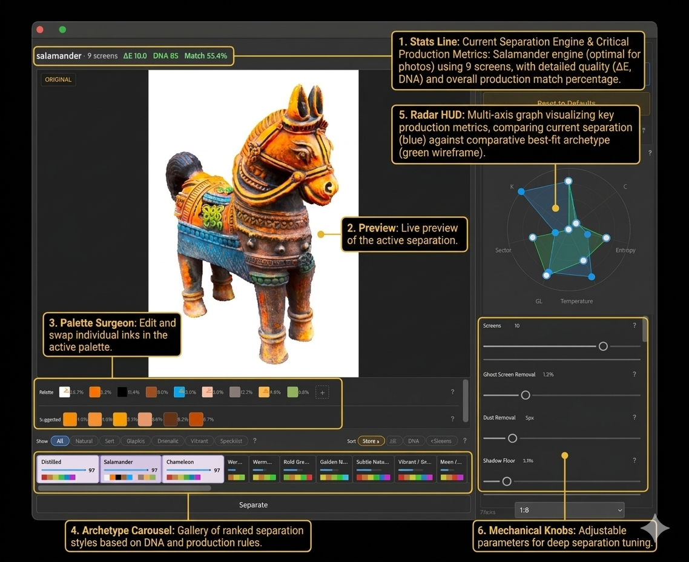

# Reveal User Guide

Reveal is an opinionated color separation tool for screen printing.

## What Reveal Does

Reveal takes a full-color image and breaks it down into a small number of spot colors — typically 5 to 8. Each color
gets its own separation, ready for film output.

This is **not** 4-color process printing (CMYK halftones) or simulated process printing (spot-color halftones that approximate full
color with 6-8 opaque inks). Reveal finds the actual colors in your image and commits to them. A sunset gets oranges and
purples. A forest gets greens and browns. The engine decides what matters and throws away the rest.

Reveal's aim is to reduce the input image to a small number of colors while still retaining what is important.
*Reduction is revelation.* If you need photorealism, then 4-color process printing or simulated process printing may be
the answer.

## How It Works

Reveal's process has four stages: **analyze**, **match**, **preview**, and **separate**.

**Analyze.** When you open an image, Reveal scans it and produces a **DNA fingerprint** — a compact summary of the
image's lightness, color intensity, contrast, texture, color temperature, and hue distribution. This takes about a
second.

**Match.** The DNA is compared against a library of built-in **archetypes**. Each archetype is a separation strategy
tuned for a different kind of image — warm portraits, bold graphics, dark moody scenes, pastel high-key, and so on.
Reveal ranks the archetypes against the image and picks the best fit, but you can switch to any archetype you like.

**Preview.** Reveal generates a color palette and a preview showing exactly what the separation will look like with the selected archetype.
The preview updates live as you browse archetypes, edit the color palette, or adjust controls. What you see is what you
get — the final output uses the same engine and settings.

**Separate.** When you're happy with the preview, you separate. Reveal maps every pixel
to the nearest palette color, and creates one Photoshop layer per ink.

### Key Concepts

- **Archetype** — A separation recipe. "Everyday Photo" favors earth tones and faithful reproduction. "Bold Poster"
  pushes contrast and saturation for graphic impact. "Fine Art Scan" protects subtle textures and tonal transitions.
  There are 26 archetypes grouped into Natural, Soft, Graphic, Dramatic, Vibrant, and Specialist families, plus 3
  adaptive pseudo-archetypes (Chameleon, Distilled, Salamander) that tune their routing logic to your image
  automatically.
- **DNA** — The image's structural fingerprint. It captures lightness, chroma, contrast, entropy, temperature, and hue
  distribution. You don't interact with it directly — it drives the automatic archetype ranking.
- **Palette** — The set of spot colors extracted from your image, typically 5-8 colors. You can edit, merge, delete, or
  add colors using the Palette Surgeon before committing.
- **Mechanical knobs** — Post-processing controls used for deep separation tuning. These include Ghost Screen Removal
  (eliminate weak inks), Dust Removal (clean up speckles), Shadow Floor (ensure faint tones print), and Trapping
  (overlap colors to prevent gaps on press).

## Requirements

- Adobe Photoshop 2023 or later (Mac or Windows)
- An image to separate

## Installing the Plugin

1. Download the latest `.ccx` file from the [Releases](https://github.com/electrosaur-labs/reveal/releases) page
2. Double-click the `.ccx` file to install (or drag it onto Photoshop)
3. Restart Photoshop if prompted
4. In Photoshop: **Plugins → Electrosaur → Reveal...**

The plugin dialog opens and auto-reads your active document.

## The Interface

The Reveal dialog has six areas, numbered in the screenshot above.

### 1. Stats Line

The bar across the top of the dialog. It shows the active separation engine, ink count, ΔE (color accuracy — lower is
better), DNA match score, and overall production match percentage. This is your at-a-glance readout: if the numbers look
good and the preview looks right, you're ready to separate.

### 2. Preview

The large center panel. This is a live preview of your separation — same engine, same palette, same knobs as the final
output. Click the preview to toggle between your original image and the separated version — a quick way to spot where
colors shifted.

The **Loupe** lets you zoom into any area. At full magnification (1-to-1) you see the actual pixels that will appear in the final
separation.

### 3. Palette Surgeon

The swatch strip to the left of the preview. Each swatch represents one ink color in your separation.

| Action                    | What it does                                                               |
|---------------------------|----------------------------------------------------------------------------|
| **Click** a swatch        | Isolate that ink in the preview — see exactly where it prints              |
| **Ctrl+click** a swatch   | Open Photoshop's color picker to replace the color with an exact ink match |
| **Drag** swatch A onto B  | Merge the two colors (B absorbs A's pixels)                                |
| **Alt+click** on a swatch | Delete that color — pixels go to the nearest remaining color               |
| **Click +**               | Add a new color via Photoshop's color picker                               |

Below the palette, **suggested colors** may appear — hues the engine detected in your image that didn't make it into
the palette (e.g., a green that got absorbed into a neighboring color). Click to preview it; Ctrl+click to mark it for
inclusion at commit time. When included, every pixel is reassigned to whichever palette color it's closest to, so pixels
that were forced into a neighbor now go to the new color if it's a better match.

### 4. Archetype Carousel

The gallery at the bottom. Each card represents a separation strategy — a different opinion about how your image should
be interpreted.

- The **top 3 picks** are pre-selected (highest match scores for your image's DNA)
- **Filter chips** narrow the list: Natural, Soft, Graphic, Dramatic, Vibrant, Specialist
- **Sort** by Score (composite quality), ΔE (color accuracy), DNA (parameter match), or screen count
- **Click any card** to switch — the preview updates live

The blue bar on each card shows how well that archetype fits your image (longer = better fit). Don't overthink scores —
browse a few and pick the one that looks right in the preview.

### 5. Radar HUD

The multi-axis chart to the right of the preview. It visualizes the current separation parameters as a polygon on
seven axes: **L** (lightness), **C** (chroma), **Entropy** (hue diversity), **Temperature** (warm/cool bias),
**σL** (lightness variation), **Sector** (primary hue dominance), and **K** (black content). The blue shape shows
the current archetype's settings; green shows the comparable best-fit archetype for reference. You can drag vertices
directly to adjust parameter values — the preview updates live.

### 6. Mechanical Knobs

The controls in the right panel. These affect the final output without changing the palette:

| Knob                     | What it does                                          | When to use it                                          |
|--------------------------|-------------------------------------------------------|---------------------------------------------------------|
| **Target Colors**        | Number of ink screens                                 | More colors = more detail, more screens to expose       |
| **Ghost Screen Removal** | Merges colors covering less than X% of the image      | Turn up to eliminate weak ink layers not worth a screen |
| **Dust Removal**         | Removes isolated pixel clusters smaller than X pixels | Turn up if you see speckles that won't hold on mesh     |
| **Shadow Floor**         | Sets minimum ink density for faint areas              | Turn up if light tones will disappear on press          |
| **Trap Size**            | Color trapping overlap width                          | Set based on your press registration tolerance          |

**Advanced panels** (click section headers to expand) expose deeper controls: chroma boost, palette reduction threshold,
hue lock, lightness/chroma weights, highlight/shadow points, substrate tolerance, and noise. Most users won't need
these.

Every knob has a `?` button that explains what it does.

## The Workflow

### Step 1: Prepare Your Image

Open your image in Photoshop. Before launching Reveal:

- **Flatten** to a single layer (Layer → Flatten Image)
- **Lab mode** — convert if needed (Image → Mode → Lab Color)
- **8-bit or 16-bit** per channel — both work; 16-bit gives better results for photos with subtle gradations

### Step 2: Launch and Ingest

Launch Reveal (Plugins → Electrosaur → Reveal...). The plugin reads your document and runs DNA analysis — a fast scan
that fingerprints the image's color temperature, contrast, chroma distribution, and texture.

Progress shows in the **stats line** (1). Takes 1-3 seconds depending on image size.

### Step 3: Browse and Choose

The **archetype carousel** (4) populates with ranked cards. Click cards to explore — the **preview** (2) updates live.
Click the preview to toggle between original and separated to check color fidelity.

### Step 4: Refine the Palette

Use the **palette surgeon** (3) to edit colors. Click swatches to isolate inks in the preview. Merge, delete, replace,
or add colors until the palette matches your ink set.

### Step 5: Dial In the Knobs

Use the **mechanical knobs** (6) or drag the **radar HUD** (5) to adjust ghost screen removal, dust removal, shadow
floor, and trap size. Watch the preview — it updates with every change.

### Step 6: Separate

When the preview looks right, click **Separate**.

The engine maps every pixel to the palette and creates layers in Photoshop:

- One **fill layer** per ink color
- Each layer has a **mask** defining where that ink prints

Reveal assumes a white substrate. If you're printing on colored garments, you'll need to account for the base color
yourself (e.g., adding a white underbase layer).

A 20-megapixel image typically separates in 1-2 seconds.

## Tips

- **Start by browsing the top picks.** The DNA matching is usually right. Browse others if the palette feels wrong, not as a
  default habit.
- **Check isolations.** Click each swatch to see what that ink covers. If a color only appears in tiny scattered spots,
  consider deleting it or increasing Ghost Screen Removal.
- **Use suggested colors** when the palette is missing an obvious hue — the engine spots these automatically.
- **16-bit input** produces better results for photographic images, especially greens and subtle tonal gradations.
- **Dithering** (in Advanced controls) adds halftone-style transitions between colors. Blue Noise gives organic
  film-grain texture. Floyd-Steinberg is classic error diffusion. None gives hard-edged posterization.
- **Reread Document** (top-right button) re-ingests the active document if you've made changes in Photoshop since
  opening the dialog.
- **Shadow Floor and mud.** On press, dark tones can collapse into a single indistinct "mud" color. Use Shadow Floor to
  set a minimum ink density so faint areas maintain enough opacity to print as distinct tones.

## Known Limitations

- Input must be **Lab mode**. Convert RGB or other modes first (Image → Mode → Lab Color).
- Input must be **flattened** to a single layer.
- On Mac, double-clicking `.ccx` may fail — drag it onto Photoshop instead, or use the install script from the release.
- After separation, Photoshop may show only 1 layer until you switch documents and back. This is a Photoshop UI refresh
  bug — your layers are all there.

## Glossary

| Term             | Meaning                                                                                                                                       |
|------------------|-----------------------------------------------------------------------------------------------------------------------------------------------|
| **Archetype**    | A separation strategy — defines how many colors, which distance metric, and how to weight the color science parameters                        |
| **DNA**          | The image's structural fingerprint — captures lightness, chroma, contrast, entropy, temperature, and hue distribution                         |
| **Lab**          | CIELAB color space — perceptually uniform, used for all internal calculations because it matches how humans see color                         |
| **Median cut**   | The quantization algorithm — recursively splits the color volume to find representative colors                                                |
| **ΔE (Delta-E)** | Perceptual color distance — how far a separated pixel drifts from its original color. Lower is better.                                        |
| **Separation**   | The final output — a set of fill layers with masks, one per ink color                                                                         |
| **Palette**      | The set of spot colors extracted from your image                                                                                              |
| **Ghost screen** | An ink layer with very low coverage — may not be worth exposing a screen for                                                                  |
| **Speckle**      | Isolated pixel clusters that won't print cleanly at typical screen printing mesh counts                                                       |
| **Trap**         | Slight overlap between adjacent ink colors that prevents white gaps from press misregistration                                                |
| **Posterization**| Reducing a continuous-tone image to a small number of flat colors — the core of what Reveal does                                             |
| **Shadow floor** | Minimum ink density for faint tones — prevents dark areas from collapsing into indistinct "mud" on press                                     |
